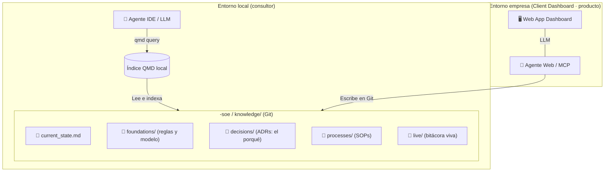

# Agentic Shared Memory (ASM)

Patrón arquitectónico para la **gestión del conocimiento y la memoria
descentralizada** de una empresa, usando **Markdown**, **Git** y **QMD**, de modo
que el "ADN corporativo" sea directamente consumible tanto por humanos como por
ecosistemas multi-agente (Claude, Antigravity, OpenClaw, etc.).

> **ASM es el componente de conocimiento del SOE.** En el entregable de cada
> empresa, ASM vive como la carpeta `knowledge/` dentro del repositorio
> `<empresa>-soe`. Ver la
> [Metodología SOE](https://github.com/alexistomaselli/metodologia-soe).

## El problema

Las empresas sufren fragmentación de contexto: el histórico de decisiones, las
reglas de negocio y los manuales operativos (SOPs) mueren en PDFs olvidados, en
Notion/Confluence, o peor, dispersos en computadoras y "cabezas distintas". Esto
genera pérdida de trazabilidad y hace que cualquier integración de IA o
consultoría requiera semanas de recolección de contexto manual.

## La solución: el patrón ASM

ASM unifica la información de la empresa bajo un estándar auditable y consumible
por cualquier inteligencia (humana o artificial).

1. **Markdown como fuente de verdad.** Todo el conocimiento (procesos, decisiones,
   reglas, bitácoras) se guarda en archivos `.md` planos versionados en Git.
2. **Transferencia inmediata.** Un LLM conectado no lee 40 páginas desordenadas:
   consulta exactamente el proceso o la decisión que necesita.
3. **QMD como cerebro local.** Cada máquina corre un índice `qmd` que vectoriza el
   repositorio en milisegundos, permitiendo a los agentes consultar el "cerebro
   corporativo" localmente.

## Estructura de la memoria (Knowledge Loop)

El patrón ASM define el esqueleto de `knowledge/`. Copia `template/knowledge/`
dentro del repositorio `<empresa>-soe`:

- `current_state.md`: fotografía consolidada del estado actual de la operación.
- `foundations/`: reglas de negocio core y modelo (lo estable).
- `decisions/`: ADRs — el histórico inmutable del *por qué*.
- `processes/`: SOPs y flujos operativos inamovibles. **Aquí vive cómo opera la empresa.**
- `live/`: buffer operativo (bitácora viva diaria; `live/daily/`, `live/sessions/`, `live/inbox/`).

> **Regla de oro:** si la información no está en los archivos Markdown (y por lo
> tanto en Git), no existe para el resto del ecosistema multi-agente.

## Skills para agentes de IA

Las **Skills** de este repositorio (`skills/`) le enseñan a un agente cómo
comportarse:

- `qmd/SKILL.md`: **fundacional.** Qué es el motor de búsqueda local QMD y cómo
  usar su CLI. Base para cualquier proyecto.
- `qmd-shared-memory/SKILL.md`: mantener la trazabilidad del trabajo diario
  leyendo la memoria a través de QMD.
- `asm-bootstrap/SKILL.md`: sembrar la estructura `knowledge/` de una empresa
  (entrevista de onboarding y generación de los archivos semilla).

## Cómo se consume: interfaces

El repositorio Git es el "backend" del conocimiento. Hay dos formas de consumirlo:

- **El consultor / ingeniero** accede al repositorio en crudo con IDEs y consola,
  trabajando directamente en Markdown.
- **La organización (cliente)** accede a través de una **capa de presentación web
  (Client Dashboard)** que renderiza los archivos en una interfaz intuitiva. El
  dashboard tiene su propio agente de IA que conversa en lenguaje natural y, por
  detrás, edita y commitea los Markdown manteniendo la estructura ASM sana.

> El **Client Dashboard es un producto/interfaz**, no parte del estándar de
> conocimiento. El patrón ASM (Markdown + Git + QMD + template + skills) funciona
> con o sin dashboard.

### Arquitectura



## Setup rápido

```bash
npm install -g @tobilu/qmd
qmd --index <empresa>-soe collection add docs ./knowledge/
qmd --index <empresa>-soe embed
```
