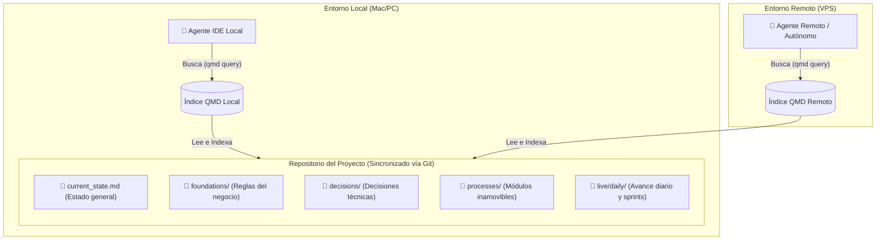

# Agentic Shared Memory

Patrón de arquitectura de **memoria descentralizada** para ecosistemas multi-agente (como Claude Code, Antigravity, OpenClaw, etc.) utilizando **Markdown**, **Git** y **QMD**.

## El Problema
Cuando múltiples agentes y herramientas de IA colaboran en un mismo proyecto desde entornos distintos (tu máquina local, un servidor VPS, etc.), compartir el contexto y mantener una "memoria de proyecto" sincronizada es difícil. Las bases de datos tradicionales (como SQLite) sufren problemas de concurrencia y despliegue distribuido. 

## La Solución
1. **Markdown como Fuente de Verdad:** Todo el conocimiento (desde las reglas de negocio estables hasta las bitácoras diarias) se guarda en archivos `.md` planos dentro del repositorio de Git.
2. **QMD como Motor de Búsqueda Local:** Cada entorno corre su propia instancia de `qmd` que indexa y busca de forma semántica e instantánea en los archivos locales.
3. **Estructura Lógica (Memory Loop):** Organización estandarizada de carpetas en `knowledge/`.

### Arquitectura Visual

## Estructura Recomendada

Copia la carpeta `template/knowledge/` de este repositorio a tu proyecto. Esto establecerá el esqueleto base:

- `live/daily/`: Buffer operativo. Aquí los agentes anotan el avance de cada sprint o sesión de manera cronológica (ej. `YYYY-MM-DD_feature-X.md`).
- `decisions/`: ADRs (Architecture Decision Records). El por qué de decisiones clave (ej. naming, elección de herramientas, etc).
- `processes/`: Módulos de negocio inamovibles y flujos operativos de la empresa (SOPs).
- `foundations/`: Reglas de negocio core, modelo de datos, procesos funcionales.
- `current_state.md`: Una fotografía consolidada del estado del proyecto.

## Skills

Si usas agentes, puedes instalarles la **Skill** proveída en este repositorio (`skills/qmd-shared-memory/SKILL.md`). Al leerla, el agente comprenderá instantáneamente cómo debe comportarse, cuándo leer de QMD y cuándo y cómo escribir en `live/daily/`.