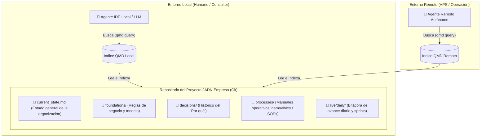

# Agentic Shared Memory (ASM)

Patrón arquitectónico para la **Gestión del Conocimiento (Knowledge Management) y Memoria Descentralizada**, diseñado para digitalizar el "ADN corporativo" de una empresa y habilitar la colaboración sin fricciones entre humanos, consultores y ecosistemas multi-agente (Claude, Antigravity, OpenClaw, etc.) utilizando **Markdown**, **Git** y **QMD**.

## El Problema Moderno
Actualmente, las empresas sufren de fragmentación de contexto: el histórico de decisiones, las reglas de negocio y los manuales operativos (SOPs) mueren en PDFs olvidados, plataformas como Notion/Confluence, o peor aún, están dispersos en computadoras y "cabezas distintas". 
Esto genera una pérdida brutal de trazabilidad para la empresa y hace que cualquier integración de IA o consultoría requiera semanas de recolección de contexto manual.

## La Solución (ASM)
El patrón **Agentic Shared Memory** soluciona esto unificando la información de la empresa bajo un estándar auditable y directamente "consumible" por cualquier inteligencia artificial o humano.

1. **Markdown como Fuente de Verdad:** Todo el conocimiento de la empresa (procesos inamovibles, decisiones técnicas, bitácoras operativas) se guarda en archivos `.md` planos versionados en un repositorio Git. 
2. **Transferencia Tecnológica Inmediata:** Un LLM conectado a esta estructura no tiene que leer 40 páginas desordenadas; puede consultar exactamente el proceso o la decisión que necesita. Esto permite a dueños y consultores auditar y escalar la empresa de inmediato.
3. **QMD como Cerebro Local:** Cada máquina (sea la laptop de un consultor o un servidor autónomo) corre un índice `qmd` que vectoriza este repositorio en milisegundos, permitiendo a los agentes IA consultar el "cerebro corporativo" localmente.

### Arquitectura Visual

## Estructura de la Memoria (Knowledge Loop)

Copia la carpeta `template/knowledge/` de este repositorio al directorio de tu empresa o proyecto para establecer el esqueleto de conocimiento:

- `live/daily/`: Buffer operativo. Aquí los humanos o agentes anotan el avance de cada sprint o sesión cronológicamente (ej. `YYYY-MM-DD_feature-X.md`).
- `decisions/`: ADRs (Architecture Decision Records). El histórico inmutable del *por qué* de decisiones clave (naming de la empresa, elección de herramientas, etc).
- `processes/`: Módulos de negocio inamovibles y flujos operativos (SOPs). **Aquí es donde vive cómo opera la empresa.**
- `foundations/`: Reglas de negocio core y procesos funcionales estables.
- `current_state.md`: Una fotografía consolidada del estado actual de la operación.

## Skills para Agentes IA

Si usas asistentes de IA, puedes instalarles la **Skill** proveída en este repositorio (`skills/qmd-shared-memory/SKILL.md`). Al leerla, el agente comprenderá instantáneamente cómo debe comportarse como miembro del equipo, cómo mantener la trazabilidad de su trabajo y cómo escribir o destilar información del negocio sin inventar reglas nuevas.